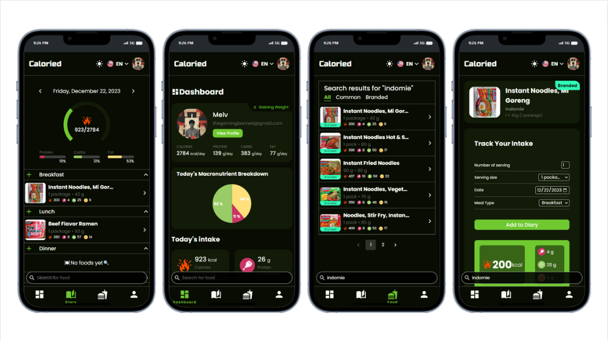
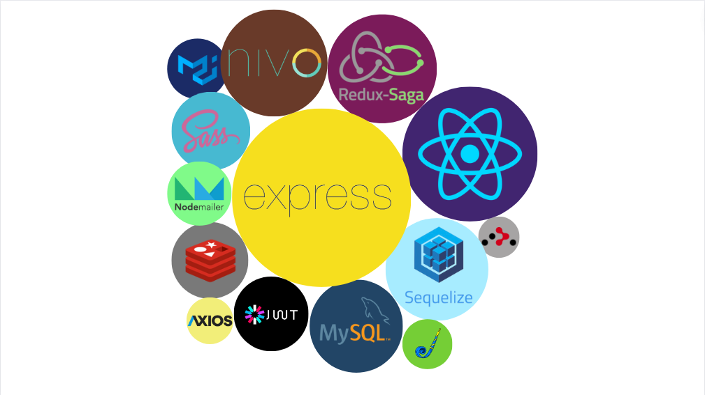
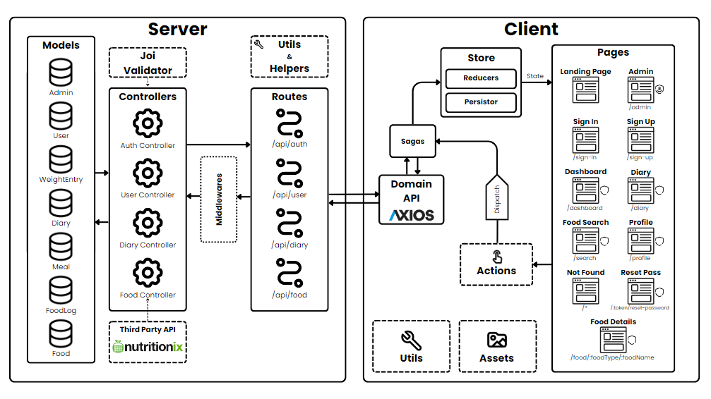

# Caloried - Nutrition & Diet Tracker App

Caloried is a diet and nutrition tracker app designed to assist users in managing their daily food consumption. The app allows users to log their meals on any given date within a personalized diary, providing a convenient method for tracking their daily recommended calorie and macronutrient intake.

> **Note**
>
> This project is still in development.

## Stack

### Frontend

The frontend of Caloried is built using the following technologies:

- **Framework:** React
- **Build Tool:** Vite
- **State Management:** Redux with react-redux
- **Side Effects:** Redux Saga
- **Styling:** Material UI, Sass
- **Form Handling:** React Hook Form
- **Charts & Analytics:** Nivo
- **Notification:** React Hot Toast
- **Internationalization:** React Intl
- **Additional Libraries:** React Calendar, React Countdown, React Countup, React Circular Progress Bar, React OTP Input

### Auth

Authentication in Caloried is handled using the following technologies:

- **JSON Web Token (JWT)**: For token-based authentication.
- **Bcrypt**: Library for password hashing.
- **CryptoJS**: Used for decryption and encryption

### Backend

The backend API of Caloried is implemented with the following technologies:

- **Framework:** Express
- **Database:** MySQL
- **ORM:** Sequelize
- **Caching:** Redis (ioredis)
- **Validation:** Joi
- **Image Upload:** Multer
- **Email Services:** Nodemailer

### External Services

- **Food Data:** [Nutritionix API](https://www.nutritionix.com/business/api)

## API Endpoints

For detailed information about the API endpoints, setup and environment variables in Caloried, please refer to the [API Endpoints README](./server/README.md).

## Client Routes

For detailed information about the client routes and setup in Caloried, please refer to the [Client Routes README](./client/README.md).

## System Architecture

**High-level architecture overview**

